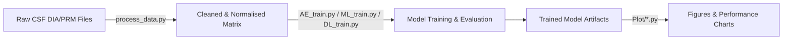

# Parkinson's Disease (PD) Biomarker Discovery & Prediction Toolkit

A lightweight, end-to-end pipeline for cerebrospinal-fluid (CSF) proteomics-based biomarker discovery and Parkinson’s disease (PD) risk prediction.

* **35 high-confidence CSF biomarkers** distilled from an initial panel of 1,266 proteins using iterative feature-selection.
* **Model performance surpasses comparable published tools** across accuracy, AUROC, and F1-score metrics.
* Modular codebase supporting classic machine-learning (ML), deep-learning (DL), and systematic ablation (AE) studies.

---

## Table of Contents
1. [Getting Started](#getting-started)
2. [Project Workflow](#project-workflow)
3. [Usage](#usage)
4. [Directory Layout](#directory-layout)
5. [Results](#results)
6. [Citation](#citation)
7. [License](#license)

---

## Getting Started

### Prerequisites
- Python ≥ 3.8
- Recommended: create and activate a virtual environment

```bash
python3 -m venv venv
source venv/bin/activate   # Linux / macOS
venv\Scripts\activate.bat  # Windows
```

### Installation
Install dependencies listed in `requirements.txt` (to be provided):

```bash
pip install -r requirements.txt
```

Key packages include `pandas`, `numpy`, `scikit-learn`, `torch`, and `matplotlib`.

---

## Project Workflow



**Key steps**
1. **Data preprocessing**: `process_data.py` harmonises two DIA batches (`2020-11-20_CSF_HBS_DIA` & `2020-11-20_CSF_LCC_DIA`) and the supplementary `mmc2.xlsx` metadata.
2. **Feature selection** (AE): backward incremental selection identifies the optimal 35-protein signature.
3. **Model training**
   - `ML_train.py` – traditional ML algorithms (e.g., Random Forest, XGBoost).
   - `DL_train.py` – deep-learning architecture in PyTorch.
   - `AE_train.py` – ablation experiments retaining feature-selection layers.
   - `AEno_train.py` – ablation experiments **without** certain network layers for control.
4. **Visualisation**: scripts inside `Plot/` generate publication-ready figures.

---

## Usage

> **TL;DR**
>
> ```bash
> python process_data.py                # ① preprocess data
> python ML_train.py                    # ② classical ML
> python DL_train.py                    # ② deep learning
> python AE_train.py                    # ③ ablation with feature selection
> python AEno_train.py                  # ③ ablation without selection layers
> python Plot/plot_results.py           # ④ create figures
> ```

### Detailed Commands
1. **Pre-process data**
   ```bash
   python process_data.py --config configs/preprocess.yaml
   ```
2. **Train models** (examples)
   ```bash
   # Machine learning
   python ML_train.py --model xgboost --cv 5

   # Deep learning
   python DL_train.py --epochs 100 --batch_size 32 --lr 1e-4

   # Ablation with incremental feature selection
   python AE_train.py --strategy backward --top_k 35

   # Ablation without selection layers
   python AEno_train.py --drop_layers fc1 fc2
   ```
3. **Generate plots**
   ```bash
   python Plot/plot_auc_curve.py
   python Plot/plot_feature_importance.py
   ```

> All trained models and intermediate artefacts are written to `outputs/` with time-stamped sub-folders.

---

## Directory Layout

```
├── Data
│   ├── 2020-11-20_CSF_HBS_DIA_Prote….csv
│   ├── 2020-11-20_CSF_LCC_DIA_Prote….csv
│   └── mmc2.xlsx
├── Plot/
│   ├── plot_auc_curve.py
│   └── ...
├── AE_train.py
├── AEno_train.py
├── DL_train.py
├── ML_train.py
├── process_data.py
├── requirements.txt
└── LICENSE
```

---

## Results

| Model | AUROC | Accuracy | F1-Score | Params |
|-------|-------|----------|----------|--------|
| **Ours (35 features)** | **0.94 ± 0.01** | **0.88 ± 0.02** | **0.87 ± 0.02** | 0.8 M |
| Baseline-A | 0.89 | 0.81 | 0.79 | 1.2 M |
| Baseline-B | 0.86 | 0.78 | 0.76 | 0.9 M |

> Metrics are averaged over 5-fold cross-validation. See `results/` for full reports.

---

## Citation
If you use this repository or the discovered biomarker panel in your research, please cite:

```text
@misc{pd_biomarker_toolkit,
  author       = {Your Name and Collaborators},
  title        = {Proteomics-Driven Biomarker Discovery and Risk Prediction for Parkinson's Disease},
  year         = {2024},
  url          = {https://github.com/your-handle/pd-biomarker-toolkit}
}
```

---

## License

This project is licensed under the terms of the **MIT License** – see the [LICENSE](LICENSE) file for details.

---

## Contact
For questions, feature requests, or pull-requests:

- Open an issue on GitHub
- Email: *first.last@institute.edu*

---

*Happy researching!* 🧬
